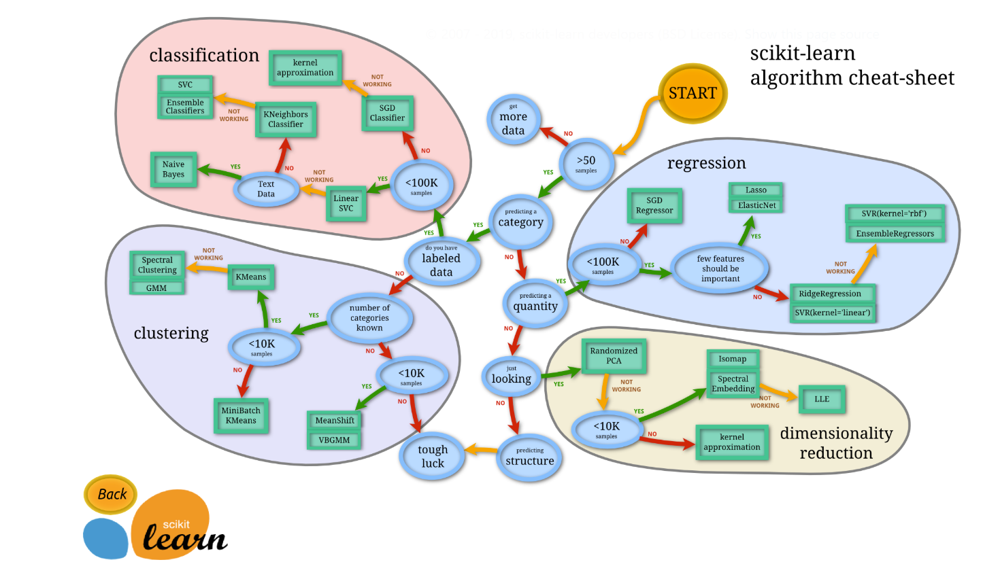

# Week 21: Machine-Learning-Challenge - Planet Exploration
By: Aukje Rijpkema 3/19/2020

## Introduction

Data used in this assignment is from NASA posted on [Kaggle](https://www.kaggle.com/nasa/kepler-exoplanet-search-results).

The Kepler Space Observatory is a NASA-build satellite that was launched in 2009. The telescope is dedicated to searching for exoplanets in star systems besides our own, with the ultimate goal of possibly finding other habitable planets besides our own.

As of October 2017 Kepler has verified over 3000 confirmed exoplanets (using all detection methods, including ground-based ones). The telescope is still active and continues to collect new data on its extended mission.

## Goal
Create a model that predicts wether a given KOI (Keppler Object of Interest) is Positive (CONFIRMED) or Negative (NON_CONFIRMED)

## Study the data

The original dataset is a cumulative record of all observed Kepler "objects of interest" — basically, all of the approximately 10,000 exoplanet candidates Kepler has taken observations on.

The dataset used in the assignment uses a selection of available columns from the original set. 

Our y-value is the Exoplanet Archive Disposition - koi_disposition
The values possible are narrowed down to 'CONFIRMED' and 'NON-CONFIRMED' (='FALSE POSITIVE)

Except for the y-value, all columns are numberic. The chart below is used to determine with model to use.

After studying the meaning behind each column, most could be eliminated. The following were kept for Machine Learning:

- Orbital Period (days) - koi_period
- Impact Parameter (dTransit Duration (hours) - koi_impact
- distance between the center of the stellar disc and the center of the planet disc) - koi_duration
- Transit Depth (parts per million) - koi_depth
- Planetary Radius (Earth radii) - koi_prad
- Equilibrium Temperature (Kelvin) - koi_teq
- Insolation Flux [Earth flux] - koi_insol
- Transit Signal-to-Noise - koi_model_snr

### Models that will be used:

- Logistic Regression
- Decision tree
- Random Forest tree

## Process data and build models

Using  1 script per model opens the dataset.

All irrelevant columns are dropped. The disposition column is converted into a 2 value column. 'CANDIDATES' are removed as they are still in the process of being evaluated by NASA. FALSE POSITIVES are named NON_CANDIDATES. CANDIDATES meet NASA's criteria indicating that the object being observed is indeed a potential habitual planet.

Subsequent steps:
* Split the data in train and test 
* Create the model
* Scale values to using standard deviation (StandardScaler)
* Fit the model (LogisticRegression, DecisionTreeClassifier, RandomForestClassifier)
* Make prediction
* Tune the model (using GridSearchCV)
* Get R-scores to show effectiveness
* Save model to:
avr_decision_tree.sav
avr_logical_regression.sav
avr_rfc_trees.sav

## Conclusions

Of the 3 models used here are the predicted R-scores:

LogisticRegression - 
- Training Data Score: 0.7639517345399698
- Testing Data Score: 0.7812971342383107

DecisionTreeClassifier
- Training Data Score: 0.9160382101558572
- Testing Data Score: 0.8740573152337858

RandomForestClassifier
- Training Data Score: 0.9866767219708397
- Testing Data Score: 0.9027149321266968

The Decision Tree model outperforms the Logistic Regression model.
THe *RandomForest model* is the best model for predicting wether and observed object is indeed a potentially habitual planet!